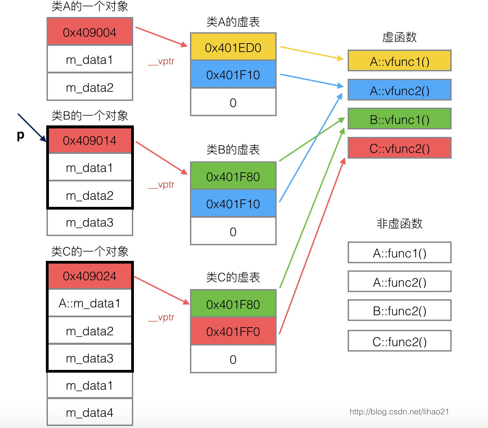

<!--
 * @Description: As vividly shown in the code, 
 * @Version: 2.0
 * @Author: pen9u1nee
 * @Date: 2023-11-08 14:13:17
 * @LastEditors: pen9u1nee
 * @LastEditTime: 2023-11-09 15:02:07
-->
1. 常量指针和指针常量 const int *p; int const *p;
2. new怎么删数组 —— new a[10]; delete []a;
3. 引用、引用作为函数的入参，引用和指针常量的区别
引用虽方便，使用须谨慎：
（1）&在这里不是求地址运算，而是起标识作用。

（2）类型标识符是指目标变量的类型。

（3）声明引用时，必须同时对其进行初始化。

（4）引用声明完毕后，相当于目标变量名有两个名称，即该目标原名称和引用名，且不能再把该引用名作为其他变量名的别名。

（5）对引用求地址，就是对目标变量求地址。即引用名是目标变量名的一个别名。引用在定义上是说引用不占据任何内存空间，但是编译器在一般将

其实现为const指针，即指向位置不可变的指针，所以引用实际上与一般指针同样占用内存。

（6）不能建立引用的数组。因为数组是一个由若干个元素所组成的集合，所以无法建立一个由引用组成的集合，但是可以建立数组的引用。

（7）引用常见的使用用途：作为函数的参数、函数的返回值。

4. 内联函数 —— 短小精悍的函数，被嵌入到正常过程中
5. 函数重载 —— 不能仅仅依靠返回值区分重载
6. 默认参数 —— 类似python
7. 函数指针 int (*fn)(int, int);
8. 命名空间和using命名空间：namespace ns1 {}

# 面向对象和类
1. struct 和 class
2. 初始化表init table，初始化 const 成员变量的唯一方法就是使用初始化列表
3. 默认构造函数 —— 无参，且仅在不定义构造函数的时候
4. 析构函数
5. <a href=https://blog.csdn.net/qq_43519886/article/details/105170209>拷贝构造函数</a> —— 什么时候使用？
6. 类的组合
7. 友元函数和友元类：单向的、不能传递的
8. 静态成员：在类的声明中只会对静态数据成员做引用性声明，需要通过类名访问/初始化。a member with an in-class initializer must be const.static 成员变量不占用对象的内存，而是在所有对象之外开辟内存，即使不创建对象也可以访问。具体来说，static 成员变量和普通的 static 变量类似，都在内存分区中的全局数据区分配内存；静态常量属性在类声明中只是声明，并没有给它分配存储空间，因此我们需要在类外部进行定义和初始化。
9. 常对象和常函数：const加在前面和后面都是什么意思？
10. 类的公有继承、私有继承、保护继承etc
11. 派生类的构造过程，和类中成员的顺序有关（基类 -> 匹配类成员和构造表 -> 执行构造函数体），和初始化表无关，和析构过程
12. 多态：运算符重载（优先性和结合性不会改变）虚函数动态多态。派生类的函数会屏蔽与其同名的基类函数（这里，虚函数的调用只需要记住这张图就可以了。基于指针选定对象不改变虚函数表的指针）。纯虚函数

